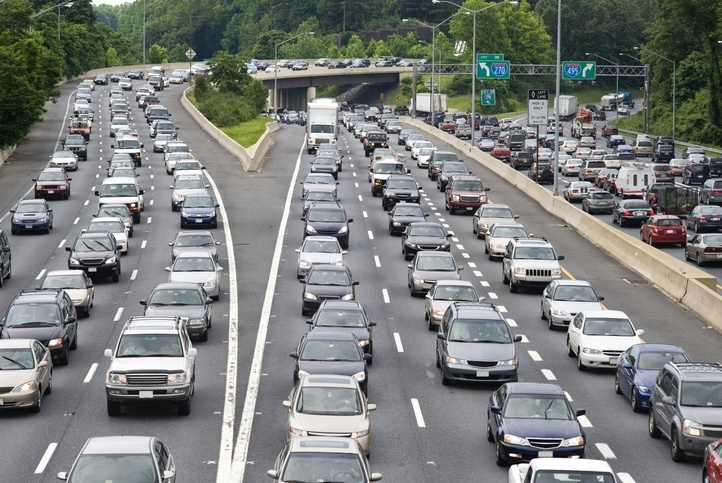
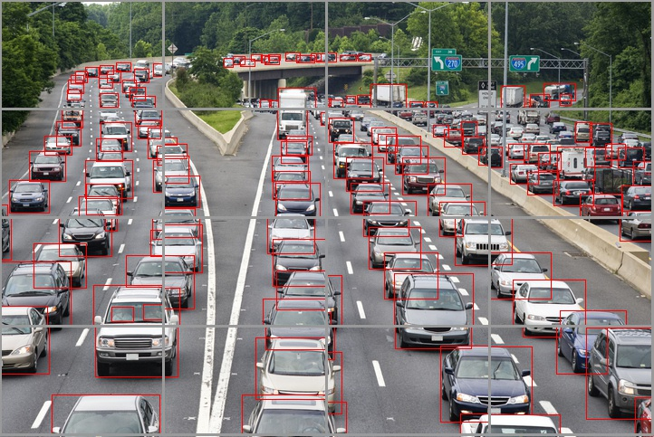

# アドバンスト創造工学研修

## Abstract
物体検出アルゴリズムyolo, 関節検知ライブラリmediapipe, 小型ドローンtelloを組み合わせたアプリケーションのコードを公開しています。各モジュールの詳細については以下のリンクを参照してください.
- [yolo v3](https://pjreddie.com/darknet/yolo/)
- [yolo v7](https://github.com/WongKinYiu/yolov7)
- [mediapipe](https://developers.google.com/mediapipe)
- [tello](https://www.ryzerobotics.com/jp/tello)

## Composition
ディレクトリ構成は以下の通りです．
- `mediapipe_dev` : モデルの作成, 簡易動作試験のスクリプト
- `sliding` : 画像を分割してから物体を検出するスクリプト
- `tello-experiment` : telloを用いた実験用スクリプト. yolo v7を使用
- `yolov3-mediapipe` : 人検知処理と関節検知処理を組み合わせたスクリプト

## Setup
### YOLO v3
[weights](https://pjreddie.com/media/files/yolov2-tiny.weights)と[cfg](https://github.com/pjreddie/darknet/blob/master/cfg/yolov2-tiny.cfg)を作業ディレクトリにダウンロードしてください．ファイルに任意の名前を付け, YOLO v3用スクリプトの`net = cv2.dnn.readNet("model_yolo.weights", "model_yolo.cfg")`の部分をファイル名に合わせて変更してください.
### YOLO v7
```
git clone https://github.com/WongKinYiu/yolov7
```
を pycharmのターミナルで実行してください．クローンが完了したら,
```
pip install requirements.txt
```
を実行して必要なモジュールをインストールします．
YOLO v3のときと同様に [weights](https://github.com/WongKinYiu/yolov7/releases/download/v0.1/yolov7.pt)をダウンロードして該当する箇所に変更を加えます. これによりdetect.pyの実行が可能になります.
### TELLO
telloを用いたデモコードを実行するためには, [MPlayer](https://drive.google.com/drive/folders/1qeqQ2OQrAgvcXlVddv23sgrmzCPKIIaB?usp=sharing)をPCにダウンロードし, PATHを通す必要があります.

## Content
### Sliding
yolo v7は高速で高精度な検出を行うことができるアルゴリズムですが, 物体が密集している場合や物体が小さすぎる場合に検出漏れや誤検知が増加する傾向があります．以下の写真は検出漏れ・誤検知が増加する典型的な例です．
  
このような画像を直接ニューラルネットワークに通すのではなく，複数の画像に分割してから通すことは，検出漏れと誤検知を防ぐ効果的な手段です．下の画像は元の画像を16枚の画像に分割した後，それぞれの画像に対して検出を行った結果です．これにより，検出漏れが大幅に減少することが分かっています．[slide_detection.py](sliding/slide_detection.py)を実行することでデモンストレーションを行うことができます．


### medeapipe-dev
Mediapipeは関節の位置情報を容易に取得できるオープンソースのライブラリです．
```
pip install mediapipe
```
をターミナル情で実行して, 自身の環境にMediapipeをインストールしてください．
  
mediapipeを用いることで写真のように手の関節の位置情報を取得することができます．あるパターンの手(グー・チョキ・パーなど)の写真を大量に集め, 関節の位置情報を記録し,学習させることで, 関節の位置情報から手のパターンを推測することが可能になります. 以下に収集・学習・動作試験の手順を示します. 
- まず, mediapipe_dev\model\内にパターン別にフォルダを作成し, 画像を保存してください. 例えば「グー」「チョキ」「パー」のフォルダを作成したら, 各フォルダ内に「グー」「チョキ」「パー」の手の写真を保存していってください. 画像の保存が完了したら, [modeling.py](mediapipe_dev/modeling.py)を実行することで, 入力画像内にある手の関節の位置情報をcsv形式で保存することができます. 
- 出力したcsvファイルを[train.py](mediapipe_dev/train.py)に入力して実行することで, 重みファイルを出力することができます. 重みファイルの拡張子は.pklです.
- 重みファイルを[test.py](mediapipe_dev/test.py)に入力して実行することで, webカメラからの映像に対する動作試験を行うことができます.

### tello experiment
TELLOドローンに搭載されたカメラから取得した映像に対して, yolov7とmediapipeによる検知を行っています. 実行直後はYOLO v7のみが起動し, 人が十分近くに検出された際にはYOLO v7が停止して mediapipeが起動します. 
TELLO単体の試験をしたい場合は [simple_takeoff.py](tello-experiment/simple_takeoff.py)または[joystick_and_video_original.py](tello-experiment/joystick_and_video_orignal.py)を実行してください.

### TODO
- TELLOから取得した映像をYOLOに入力する処理が最適化されていません. ここで遅延が生じています.
- 現在はjoystickからの入力に対する応答処理とYOLO v7による検出を並列で行っていますが, 割り込み処理を用いた方が処理を軽量化できる可能性があります.